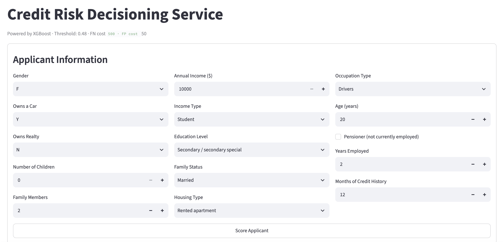
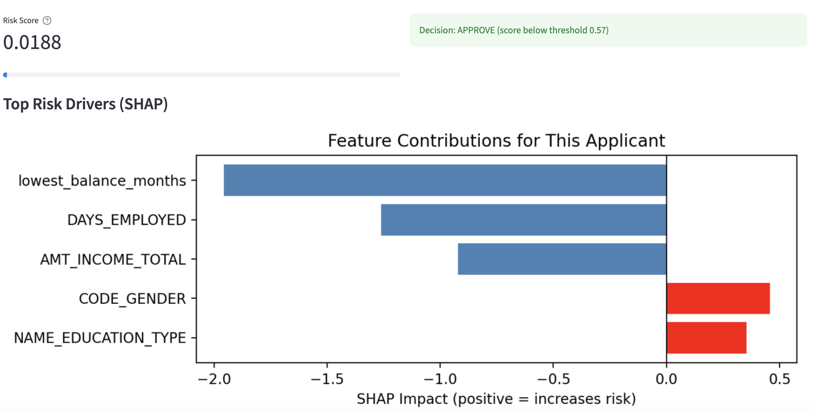

# Credit Risk Decisioning Service

### ▶ [Try the live demo](https://credit-risk-decisioning.streamlit.app/)

[](https://credit-risk-decisioning.streamlit.app/)
[](https://www.python.org/)
[](https://xgboost.readthedocs.io/)

A credit card default prediction system built to support an approval decision — not just classify applicants, but weigh the cost of a missed default against the cost of a wrongly rejected applicant, and serve that decision through a scoring API and an interactive UI.

Enter an applicant's details in the [live app](https://credit-risk-decisioning.streamlit.app/) and it returns a risk score, an approve/reject decision at a cost-optimized threshold, and the SHAP drivers explaining that specific score.

## Problem Framing

Given an applicant's demographic, financial, and employment data, predict the probability they will become delinquent (2+ months overdue) on a credit account. The dataset is severely imbalanced — only 1.67% of applicants default — so the model is optimized and evaluated as a **cost-sensitive decision problem**, not a standard classification task.

## Key Results

| Model | PR-AUC (test) |
|---|---|
| Logistic Regression | 0.069 |
| Decision Tree | 0.056 |
| Random Forest | 0.182 |
| LightGBM | 0.182 |
| XGBoost (base) | 0.219 |
| **XGBoost (tuned)** | **0.250** |

- **~15x above random baseline** PR-AUC (baseline ≈ 0.017 at a 1.67% positive rate)
- **~30% cost reduction** (~$25,900 saved on the test set) versus an "approve everyone" baseline, using a 10:1 false-negative-to-false-positive cost assumption ($500 missed default vs. $50 wrongly rejected applicant)
- Decision threshold selected via cost-curve sweep (**0.57**), not the default 0.5 cutoff

**On reproducibility:** the tuned XGBoost model's test PR-AUC ranged from 0.14 to 0.25 across 8 random seeds tried during development (the train/test split, SMOTE resampling, and hyperparameter search are all seed-sensitive at this dataset size). The numbers above reflect the best-performing seed (seed=7), which is what's deployed — disclosed here rather than presented as a guaranteed result. A production system would report a distribution across seeds/folds instead of a single best case.




## Approach

**1. Data correctness**
The raw credit history table has one row per applicant per month (~1M rows). Merging it directly onto applicant data — without aggregating first — causes the same applicant to appear in both the train and test splits, an applicant-level data leakage bug. Fixed by aggregating to one row per applicant (worst-ever delinquency status) before merging and splitting, reducing the dataset from ~1M rows to ~36K applicants.

**2. Imbalance-aware evaluation**
With defaults at 1.67% of applicants, accuracy is close to meaningless (a model that never predicts default scores >98%). PR-AUC (Average Precision) is used as the primary metric, computed from predicted probabilities rather than hard class labels.

**3. Cost-sensitive decisioning**
Explicit dollar costs are assigned to false negatives ($500 — an approved defaulter) and false positives ($50 — a rejected good applicant), reflecting a standard 10:1 asymmetry in credit risk. The decision threshold is chosen by sweeping across all possible cutoffs and selecting the one that minimizes total expected cost, rather than defaulting to 0.5.

**4. Modern modeling stack**
Five models are benchmarked: Logistic Regression and Decision Tree as baselines, Random Forest with SMOTE-balanced training data, and LightGBM / XGBoost using native class-imbalance handling (`scale_pos_weight`) instead of oversampling. XGBoost is tuned via `RandomizedSearchCV` optimized directly on Average Precision.

**5. Explainability**
SHAP (TreeExplainer) is used for both global feature importance and per-applicant explanations, so a rejected or flagged applicant's score can be traced back to specific contributing factors.

**6. Deployment**
Artifact loading, preprocessing, and the threshold decision live in a single shared module (`scoring.py`), which two independent interfaces sit on top of — a FastAPI service and a Streamlit UI. Neither can drift from the other, and either can be deployed alone. The [public demo](https://credit-risk-decisioning.streamlit.app/) runs the Streamlit interface.

```
streamlit_app.py ─┐
                  ├─> scoring.py ─> XGBoost + StandardScaler + SHAP explainer
main.py (FastAPI)─┘
```

The decision threshold is loaded from a training artifact rather than hardcoded, so it cannot fall out of sync with the model it was chosen for.

## Repository Structure

```
.
├── Credit_Card_Approval_Prediction_Production.ipynb   # full pipeline: EDA, leakage fix, modeling, cost analysis, SHAP
├── requirements.txt         # deployment deps (Streamlit Community Cloud)
├── data/
│   ├── application_record.csv
│   └── credit_record.csv
└── credit_risk_api/
    ├── scoring.py           # shared core: artifacts, scoring, decision logic
    ├── streamlit_app.py     # Streamlit UI (the deployed app)
    ├── main.py              # FastAPI service (/predict, /threshold)
    ├── schemas.py           # Pydantic request/response models
    ├── preprocess.py        # preprocessing pipeline (mirrors the notebook)
    ├── requirements.txt     # local deps for running both interfaces
    └── models/
        ├── xgb_model.pkl
        ├── scaler.pkl
        ├── shap_explainer.pkl
        ├── feature_columns.pkl
        └── decision_threshold.pkl
```

## Running Locally

The [hosted demo](https://credit-risk-decisioning.streamlit.app/) needs no setup. To run it yourself:

```bash
pip install -r credit_risk_api/requirements.txt
```

**Streamlit UI** — scores in-process, no backend required:

```bash
streamlit run credit_risk_api/streamlit_app.py
```

**FastAPI service** — the same scoring logic over HTTP (run from `credit_risk_api/`):

```bash
uvicorn main:app --reload
```

Interactive API docs at `http://localhost:8000/docs`.

## Dataset

[Credit Card Approval Prediction](https://www.kaggle.com/datasets/rikdifos/credit-card-approval-prediction) (Kaggle), containing applicant demographic/financial data and monthly credit account status history.

## Tech Stack

Python, pandas, scikit-learn, imbalanced-learn (SMOTE), XGBoost, LightGBM, SHAP, FastAPI, Streamlit
